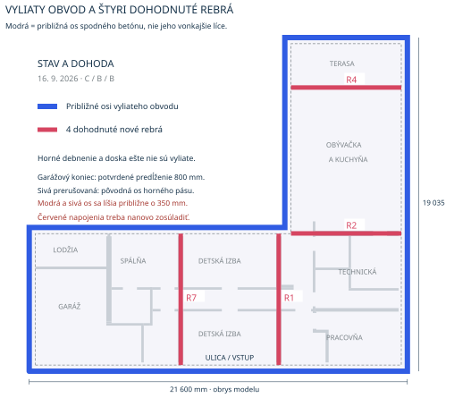
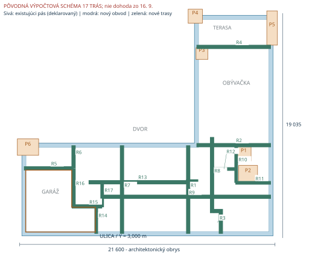
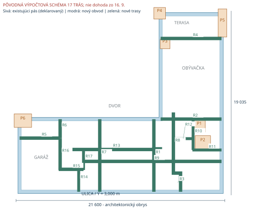
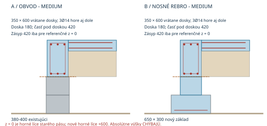
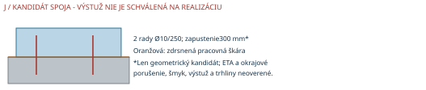

# Dokončenie základov a dosky C16/20

**Revízia AK-01/AK-02, 16. 9. 2026:** aktuálne je SM30, jedna 300 mm obvodová tehla so zachovaným účelom odhlučnenia. Táto štúdia používa zmrazené pôvodné zaťaženia SA30; výsledky pre stenové zaťaženia a R7 sa nepovažujú za prepočet SM30. Konkrétny výrobok a nový prepočet zostávajú otvorené. Samostatné geometrické kóty a výpočty bez stenového zaťaženia týmto nie sú prerátané. Pozri [záznam revízie](/Users/davidzita/www/dom/foundation-analysis/inputs/wall-revision-sm30-20260916.md).

Podmienená výpočtová štúdia; hlavný PDF report má 10 strán A4.

## Základy C16/20: rozhodnutie a hranice návrhu
Existujúce pásy zatiaľ nemožno potvrdiť ako dostatočné. Pri šírke 380 mm vychádza v skúmanom zaťažovacom obale tlak až 296 kPa pri excentricite 25 mm; pôvodná statika predpokladala 150 kPa. Hrubšia doska tento nedostatok základovej plochy neodstráni.
Nová revízia 16. 9.: betón vedie približne stredom obvodových čiar; garážový koniec bol predĺžený o800 mm. Do koordinácie sa preberá šírka21 600 mm. Staré kóty od líc horného obvodu sú prekonané. Pôvodná os horného pásu je od takto interpretovaného spodného betónu odsadená asi350 mm; podopretie a napojenia štyroch rebier sa musia zosúladiť. Nasledujúce výpočty pre17trás tento stav neoverujú.
| Variant | Výsledok výpočtu | Stav celého domu |
| --- | --- | --- |
| MIN | 150 mm izby / 180 mm garáž; miestne kontroly vyhovujú podmienene. | NEPREUKÁZANÝ |
| MEDIUM | 180 mm všade; menší priehyb a jednoduchšie výškové detaily. | NEPREUKÁZANÝ |
| MAX | 200 mm; vyššia rezerva kolesa nad dutinou 1,5 m. | NEPREUKÁZANÝ |
Hlavné prekážky: skutočné podložie a základová škára, bodové reakcie krovu/povaly, neznáma výstuž a stav starého betónu, pracovné škáry, expozícia a 100-ročná trvanlivosť. Žiadny variant nemá status „pripravené na realizáciu“.

Foto IMG_7530: 1 horné debnenie bez preukázanej betonáže; 2 navŕšená zemina s vegetáciou nie je prevzatý zásyp; 3 podpery debnenia. Fotografia nemá spoľahlivú mierku. Zvyšné dve fotografie dokladajú skorší otvorený výkop; presnú výstuž ani základovú škáru z nich neurčujem.
Potvrdenie investora 15. 9. 2026: vyliate sú iba spodné pásy, horná konštrukcia a doska ešte nie. Starší zápis o vyliatej doske je týmto nahradený. Rozmer „35 cm“ zostáva bez významového potvrdenia; návrhových 350 × 600 mm je predpoklad tejto štúdie.

## Vyliaty obvod a dohodnuté štyri rebrá

| Rebro / od čiary* | Šírka** | Do bližšieho líca | Do osi | Do ďalšieho líca |
| --- | --- | --- | --- | --- |
| R7 / ľavý A | 350 mm | 8478 mm | 8653 mm | 8828 mm |
| R1 / pravý C | 350 mm | 7173,5 mm | 7348,5 mm | 7523,5 mm |
| R2 / uličný B | 350 mm | 7687 mm | 7862 mm | 8037 mm |
| R4 / zadný D | 350 mm | 2675 mm | 2850 mm | 3025 mm |
*Referencie sú teraz ČIARY: A=X6440, B=Y3000, C=X28040, D=Y22035. Betón je podľa investora približne v ich strede; nejde o presné betónové hrany. **350 mm je pracovná šírka zo štúdie so17trasami, pre4rebrá staticky nepotvrdená. Staré kóty od vonkajších líc horného pásu už neplatia pre túto interpretáciu.
ZK-01/ZK-02: drawings/technical/agreed-ribs-technical.pdf, A3, 1:100. Červené osi a konce zostali z modelu; ich napojenia na modrý obvod sú otvorené. OsR2 je338 mm pred L-rohom. Pôvodné osy horného pásu sú od modrých čiar349-354 mm; ich podopretie sa nesmie prevziať bez nového zosúladenia.
Zdroj: nový obrázok8:56 a výslovné potvrdenie predĺženia garáže800 mm. Zdrojové19 050/10 840/14 550 sa líšia od modelových19 035/10 835/14 600 mm; rozdiely sú na listeZK-02. Strany3-10 sú pôvodná štúdia, nie výpočet novej interpretácie skutočného obvodu.

## Zaťaženia, existujúce pásy a sadanie
Nosná cesta skúmaného systému: strecha + drevená skladovacia povala → skutočné nosné steny/prievlaky → obvodový sokel a nové vnútorné základy → rastlá zemina. Doska nesie podlahu a miestne úžitkové zaťaženie. SA30 a H200 nenesú strechu. Jej skutočné bodové reakcie nie sú nahradené plošným priemerom; výpočet nižšie je kontrolný reakčný obal, nie vyriešený globálny model krovu.
| Parameter | Použitý predpoklad |
| --- | --- |
| Materiál / súčinitele | fck16; fctm1,9; Ecm28 600 MPa; fcd=0,85×16/1,5=9,07 MPa; B500B fyd434,8 MPa. αcc0,85 je konzervatívny predpoklad, nie overený český NDP. |
| Plošné a líniové zaťaženia | Strecha1,40 + drevený strop0,75 kN/m². Sneh0,80 kPa (sk1,0; bez dôkazu závejov). Povala 2,0 a 7,5 kPa - citlivostné prípady, nie odsúhlasené užívanie. Obvod: 300 mm murivo12 kN/m³ + 2×15 mm omietka18 kN/m³; h3,125 m. |
| Obvodový metrový úsek | Tributárna šírka4,10 m; Gk obsahuje aj veniec, nový sokel a starý pás. NEd=1,35Gk+1,50(Qk+sneh), bez zníženia súbehu ψ. B′=B−2e; qEd=NEd/B′. |
| Povala kPa | NEd kN/m | qEd: e=0 / 25 mm | B nutná pri150 kPa* |
| --- | --- | --- | --- |
| 2.0 | 63.9 | 168 / 194 kPa | 476 mm |
| 7.5 | 97.7 | 257 / 296 kPa | 701 mm |
*Ide o potrebnú celkovú šírku B pri zachovanom obale síl a e25 mm, nie o dovolenie priliať betón vedľa pásu. Pri rozšírení treba preniesť sily do novej plochy a zohľadniť vlastnú tiaž, podkopanie, pracovné etapy a sadanie. Tieto detaily pri neznámom podloží nie sú navrhnuté na realizáciu.
| Eoed / vrstva2 m | s pri povale2,0 | s pri povale7,5 | Rozdielne sadanie |
| --- | --- | --- | --- |
| 3 MPa | 28.2 mm | 42.0 mm | Pri E/2 sa s zdvojnásobí. |
| 8.5 MPa | 9.9 mm | 14.8 mm | Pri E/2 sa s zdvojnásobí. |
| 15 MPa | 5.6 mm | 8.4 mm | Pri E/2 sa s zdvojnásobí. |
Kontrola s=NSLS·ln[(B+H)/B]/Eoed, B0,38 m: približné šírenie 2:1, bez odpočtu odťaženej zeminy; bez konsolidácie, objemových zmien a kolapsu. Projektové kritériá: s≤25 mm a Δs≤8 mm/4 m (1/500). Už Eoed8,5→4,25 MPa poruší diferenčné kritérium. Zásyp vedľa pásu pridáva napätie: široké priťaženie12 kPa na vrstve2 m pri Eoed8,5 MPa dá ďalších2,82 mm; skutočné etapy treba doplniť.
| Sokel350×600, dutina2 m | MIN | MEDIUM | MAX |
| --- | --- | --- | --- |
| MEd/MRd [kNm] | 48.86/75.64 | 48.86/101.07 | 48.86/129.21 |
| VEd/VRds [kN] | 97.72/105.43 | 97.72/105.23 | 97.72/105.03 |
| f / limit [mm] | 1.08/8.00 | 0.85/8.00 | 0.69/8.00 |
| w / limit [mm] | 0.32/0.30 | 0.21/0.30 | 0.15/0.30 |
MIN pri dutine2 m prekročí limit trhliny0,30 mm; MED a MAX týmto testom prejdú. Kontrola horného obvodového nosníka nezapočítava starý betón do ohybu. Neplatí pre celú dĺžku R1 ani automaticky pre užšie rebrá. Pri nosných vnútorných pásoch vychádza max. qEd MIN146,6 / MED136,1 / MAX127,1 kPa proti predpokladu150 kPa; bodové reakcie pri otvoroch zostávajú nepreukázané.
Vietor: skúmané čisté tlaky0,8/1,5 kPa dávajú na čelnej ploche21,6×5,56 m vodorovne96/180 kN; výsledný návrhový vztlak strechy po odpočte0,9G je −15/+250 kN. Nejde o normové určenie vetra pre pozemok. Závej1,6 kPa pridá obvodu4,92 kN/m; lokálna PV sústava sa uvažuje osobitne3 kN. Voda0,6 m nad spodkom dosky dáva návrhový vztlak8,83 kPa oproti stabilizujúcemu MED5,85 kPa: nevyhovuje bez ďalšieho opatrenia. Tieto obaly odhaľujú potrebné kontroly; kotvy a stabilita celej stavby nie sú uzavreté.

## Pôvodná štúdia: množstvá pre 17 trás
| Nové práce od dnešného stavu | MIN | MEDIUM | MAX |
| --- | --- | --- | --- |
| Doska izby / garáž [mm] | 150 / 180 | 180 / 180 | 200 / 200 |
| Betón C16/20 celkom [m³] | 89.59 | 94.58 | 98.49 |
| z toho doska [m³] | 36.55 | 42.97 | 47.74 |
| obvod/rebrá pod doskou [m³] | 29.02 | 27.24 | 26.04 |
| nové spodné základy [m³] | 24.02 | 24.37 | 24.71 |
| Oceľ s prirážkami [kg]* | 6541 | 7061 | 8927 |
| Debnenie účinných plôch [m²]* | 217.7 | 217.7 | 217.7 |
| Nové ryhy, geometrický objem [m³]* | 43.5 | 44.2 | 44.9 |
| Zásyp pre referenčné výšky [m³]* | 79.7 | 75.0 | 71.4 |
Betón je geometrický súčet bez prekrývania objemov. Nosná plocha dosky je 238.72 m² po vonkajšie líce sokla, nie architektonických 252,965 m² po obálku domu. Zahŕňa lodžiu a terasu; ich povrchové a mrazové riešenie zostáva otvorené. Spoločný obvod má 78.456 m, vnútorné trasy 86.160 m.
MIN → MEDIUM: +4.99 m³ a približne +520 kg ocele. Jedna hrúbka180 mm odstraňuje výškový prechod garáže; pri dvojmetrovej dutine pod izbami klesá vypočítaný priehyb z 3.65 na 2.28 mm. Širšie nové pásy znižujú kontaktné tlaky; existujúci obvod zostáva limitom.
MEDIUM → MAX: +3.91 m³ a približne +1865 kg ocele. Garáž zvládne skúmanú dutinu1,5 m, ktorú MEDIUM na šmyk nezvládne. Bez požiadavky na tento scenár je prínos podstatne menší než nárast ocele. MAX nie je dokázaná absolútna ekonomická hranica; zmenou technológie alebo podopretia môže vzniknúť lepšie riešenie.
*Oceľ: siete a pozdĺžne prúty +15 % na presahy/odrezky, strmene a miestne prirážky; nejde o dielenský výkaz. Debnenie je hrubý technologický model. Ryhy uvažujú150 mm pracovného priestoru na každú stranu. Odhumusovanie0,20 m pridáva47,74 m³ odťažby a približne rovnakú potrebu náhradného zásypu pred odpočtom prienikov základov; tabuľka zásypu pokrýva iba priestor NAD z=0. Objednávka zásypu musí zahŕňať aj spodnú náhradu. Prekrývajúce výkopy sa nesmú sčítať dvakrát.
Cenový model: C = Vbetón·pbetón + Moceľ·poceľ + Adebn·pdebn + Vvýkop·pvýkop + Vzásyp·pzásyp + Vodvoz·podvoz + kotvy + skúšky + práca. Sadzby sú prázdne, pretože porovnateľné miestne ponuky chýbajú. Nové podchytenie obvodu, hydroizolácia, mrazová ochrana, prípojky a konečné kotvy nie sú ocenené ani skryté v betóne.
| Lokálne bloky (spoločné) | Rozmer X×Y [m] | P obal / qEd* |
| --- | --- | --- |
| P1 AKU800 | 1.20 × 1.20 | 20 kN / 61 kPa |
| P2 kotol | 1.60 × 1.40 | 20 kN / 54 kPa |
| P3 kachle | 1.00 × 1.00 | 10 kN / 56 kPa |
| P4 terasa Z | 1.20 × 1.20 | 60 kN / 103 kPa |
| P5 terasa V | 0.90 × 2.90 | 60 kN / 75 kPa |
| P6 lodžia L | 1.80 × 1.40 | 60 kN / 76 kPa |
*Predpokladané bloky od z−600 po+600 mm, spodná zóna350 mm: Ø12/150 oba smery dole aj hore, plášť Ø10/200 oboma smermi, nad tým všeobecná sieť dosky. Bodový obal zahŕňa tiaž podporovaného zariadenia/piliera aj prípadnú reakciu; sily nie sú dodané výrobcom/krovárom. Tlak predpokladá účinnú celú plochu. P4-P6 sa prekrývajú so starým pásom: bez navrhnutého prenosu do novej plochy NEPREUKÁZANÉ. Najvyšší skríningový šmyk0,289 MPa oproti0,351 MPa nenahrádza úplný dôkaz pretlačenia.

## MIN: pôvodná výpočtová schéma 17 trás

| Prvok | Navrhnutý prierez / výstuž (podmienene) |
| --- | --- |
| Doska | 150 mm; garáž 180 mm. Ø8/150 izby, Ø10/125 garáž - hore aj dole, oba smery. cnom35 mm; Dmax16 mm. |
| Obvod a R1-R7 | 350 × 600 mm vrátane dosky; časť pod doskou 450 mm. 3Ø12 hore + 3Ø12 dole; strmene Ø8/200, pri uzloch Ø8/100 na600 mm. |
| Doplnkové R8-R17 | Šírka300 alebo350 mm podľa routes.csv; H600 mm. Rovnaká pozdĺžna výstuž a strmene. Každá trasa má vlastnú súvislú podporu na rastlej zemine. |
| Spodné vnútorné základy | R1-R5 nosné trasy: 600 × 300 mm; ostatné400 × 300 mm. Ø12/150 dole oba smery; stredný driek300 mm vysoký, šírka podľa rebra; zvislé Ø10/200 na oboch lícach. |
MIN je najnižšia spotreba v preskúmanej rodine. Nie je preukázané, že ide o najlacnejší vyhovujúci návrh celej stavby. V garáži sa180 mm zachováva kvôli šmyku; 150 mm s Ø10/125 zlyhalo. Oranžová hranica označuje modelový rozsah garáže; prechod hrúbky smeruje nadol, horné líce je rovné.
Kóty polohy R1-R7 sú v tabuľke detailov; R8-R17 sledujú presné líniové osi všetkých zvyšných modelových stien v drawings/routes.csv. Každý identifikátor je naviazaný na wall-loads.csv; 37 úsekov je geometricky pokrytých. Polohy nie sú vytyčovacím podkladom bez zamerania starých pásov.

## MEDIUM: pôvodná výpočtová schéma 17 trás

| Prvok | Navrhnutý prierez / výstuž (podmienene) |
| --- | --- |
| Doska | 180 mm; garáž 180 mm. Ø8/150 izby, Ø10/100 garáž - hore aj dole, oba smery. cnom35 mm; Dmax16 mm. |
| Obvod a R1-R7 | 350 × 600 mm vrátane dosky; časť pod doskou 420 mm. 3Ø14 hore + 3Ø14 dole; strmene Ø8/200, pri uzloch Ø8/100 na600 mm. |
| Doplnkové R8-R17 | Šírka300 alebo350 mm podľa routes.csv; H600 mm. Rovnaká pozdĺžna výstuž a strmene. Každá trasa má vlastnú súvislú podporu na rastlej zemine. |
| Spodné vnútorné základy | R1-R5 nosné trasy: 650 × 300 mm; ostatné400 × 300 mm. Ø12/150 dole oba smery; stredný driek300 mm vysoký, šírka podľa rebra; zvislé Ø10/200 na oboch lícach. |
Nosné rebrá sa nepovažujú za nosníky preklenujúce celú dĺžku. Prirodzená zemina musí byť prevzatá pod celou trasou. Ak je pod R1 len zásyp a podpery iba na koncoch7,495 m, uvedená výstuž neplatí. SA30 zaťažuje R7 dvoma líniami ±100 mm; vrátane omietok a vaty model6,25 kN/m, priebežná chodba zostáva bez steny.
Kóty polohy R1-R7 sú v tabuľke detailov; R8-R17 sledujú presné líniové osi všetkých zvyšných modelových stien v drawings/routes.csv. Každý identifikátor je naviazaný na wall-loads.csv; 37 úsekov je geometricky pokrytých. Polohy nie sú vytyčovacím podkladom bez zamerania starých pásov.

## MAX: pôvodná výpočtová schéma 17 trás

| Prvok | Navrhnutý prierez / výstuž (podmienene) |
| --- | --- |
| Doska | 200 mm; garáž 200 mm. Ø10/150 izby, Ø12/150 garáž - hore aj dole, oba smery. cnom35 mm; Dmax16 mm. |
| Obvod a R1-R7 | 350 × 600 mm vrátane dosky; časť pod doskou 400 mm. 3Ø16 hore + 3Ø16 dole; strmene Ø8/200, pri uzloch Ø8/100 na600 mm. |
| Doplnkové R8-R17 | Šírka300 alebo350 mm podľa routes.csv; H600 mm. Rovnaká pozdĺžna výstuž a strmene. Každá trasa má vlastnú súvislú podporu na rastlej zemine. |
| Spodné vnútorné základy | R1-R5 nosné trasy: 700 × 300 mm; ostatné400 × 300 mm. Ø12/150 dole oba smery; stredný driek300 mm vysoký, šírka podľa rebra; zvislé Ø10/200 na oboch lícach. |
MAX zvyšuje ohybovú rezervu aj hmotnosť konštrukcie. Nespraví zo slabej zeminy únosný podklad. Ani200 mm doska nie je navrhnutá na zmiznutie všetkého zásypu. Vonkajšie časti vyžadujú oddelenie teplotných polí a doriešenie expozície; spoločná kresba neznamená automatický tuhý monolit.
Kóty polohy R1-R7 sú v tabuľke detailov; R8-R17 sledujú presné líniové osi všetkých zvyšných modelových stien v drawings/routes.csv. Každý identifikátor je naviazaný na wall-loads.csv; 37 úsekov je geometricky pokrytých. Polohy nie sú vytyčovacím podkladom bez zamerania starých pásov.

## Rezy, výstuž a pracovné škáry

| Trasa | Súradnice osi X/Y [m], pôvodný modelový rámec |
| --- | --- |
| R1 / R7 | X20,6915 / X15,093; Y3,354 →10,849; dĺžka7,495. |
| R2 / R4 | Y10,862 / Y19,185; X21,393 →27,691; dĺžka6,298. |
| R3 | (23,4545;3,354)→(23,4545;5,2825)→(22,842;5,2825). |
| R5 / R6 | R5: Y8,897; X6,794→10,993. R6: X10,993; Y8,897→10,849. |

Výstužný detail MEDIUM: cnom50 mm k betónovanému povrchu základov a sokla (pracovný predpoklad), 35 mm v doske. 3Ø14 pri každom hornom a dolnom líci; uzavreté strmene Ø8. Rovné kotevné dĺžky pri plnom fyd a dobrom súdržnom prostredí: Ø10≈558, Ø12≈669, Ø14≈780, Ø16≈892 mm. Návrh vyhradzuje 1000 mm za uzlom; v rohoch použiť L/U prúty, nie koniec rovného prúta na hrane. Presahy pri α6=1,5: približne840/1010/1170/1340 mm; rozmiestniť mimo uzlov. Súdržnosť hornej výstuže a skutočné podmienky betonáže treba overiť; zhoršené podmienky dĺžky zväčšujú.
Starý/nový betón: odstrániť laitanciu a uvoľnené časti, zmapovať trhliny, overiť zdravý podklad, očistiť a zdrsniť; vlhkosť podľa technológie. Na preukázanie trenia sa ráta c=0, μ=0,5 iba pri overenom kontakte bez separačnej fólie: HEd≤μNEd,min. Pri zásype600 mm + stavebnom priťažení10 kPa vychádza HEd7,20 kN/m, vlastná tiaž sokla dáva len2,36 kN/m trenia. Bez dočasného zavetrenia alebo schválených spojov nezásypovať jednostranne.
Kandidát kotvenia: dve rady dodatočných Ø10/250 s predbežne300 mm zapustením; pri fbd,PIR2,0 MPa je čisto súdržnostný limit18,85 kN/prút. To NIE JE únosnosť kotvy v šmyku ani okrajovom vylomení. Presné ETA, poloha pôvodnej výstuže, okraje, trhliny, rozštiepenie a 100-ročný návrh chýbajú; tento detail ostáva nepreukázaný. Spoje nových pásov sa plánujú mimo uzlov, výstuž priebežná; dodatočné otvory cez rebrá sa nepovoľujú týmto výpočtom.

## Doska: únosnosť, trhliny a strata podpory
Doska je podlahová doska na podloží; nie základová doska domu ani doska voľne rozpätá cez celé L. Výpočtový stav: lokálna vnútorná nepodopretá ryha široká1,0 m, na oboch stranách spoľahlivé priame podopretie a ≥1,0 m zakotvenej výstuže. Obytné pole: g=25h+2 kPa, q=2 kPa. Garáž: jedno koleso10 kN na200×200 mm, účinok priradený iba200 mm širokému pásu; ďalšie koleso v tej istej ryhe, zdvihák a ťažšie auto nie sú pokryté.
| Rozhodujúci prierez / L | MEd/MRd kNm/m | VEd/VRd kN/m | w /0,30 mm | f / L/250 mm |
| --- | --- | --- | --- | --- |
| MIN izba /1,0 | 1.35/13.84 | 5.38/42.84 | 0.029 | 0.23/4.0 |
| MED izba /2,0* | 5.89/18.21 | 11.78/52.67 | 0.109 | 2.28/8.0 |
| MIN garáž/1,0 | 19.85/31.40 | 59.89/61.70 | 0.159 | 0.90/4.0 |
| MED garáž/1,0 | 19.85/37.96 | 59.89/66.46 | 0.116 | 0.76/4.0 |
| MAX garáž/1,5* | 30.78/42.26 | 67.39/71.16 | 0.219 | 2.10/6.0 |
Využitie garáže L1 m: MIN ohyb63 %, šmyk97 %; MED ohyb52 %, šmyk90 %. *L1,5 a2 m sú testy robustnosti. Šmyková redukcia podľa EC2 6.2.2(6) používa polohu výslednice sily a platí iba pri priamom podopretí a plnom zakotvení; bez nej surový VEd71,89 kN/m prekročí aj MED66,46. Voľné okraje, prestupy a L-roh tento model nepokrýva.
| Referenčná možnosť | Záver |
| --- | --- |
| 100 mm, obe siete Ø8/150, c35 | Vertikálna vôľa100−2×35−4×8=−2 mm: nemožno zrealizovať. Aj keď ohyb obytného pásu L1 m číselne vyjde, tento detail NEVYHOVUJE. Jedna sieť sa tu nepreukázala ako náhrada. |
| 150 mm garáž, Ø10/125 | Pri posúvaní kolesa VEd63,88>VRd51,80 kN/m: NEVYHOVUJE. Preto MIN garáž180 mm. |
| 180 / 200 mm - robustnosť | MED garáž180 pri L1,5 m: šmyk68,58>66,46, nevyhovuje. MAX200 pri L1,5 m vyhovuje. Pri L2 m zlyhá šmyk73,43>71,16 a wchar0,337>0,30 mm. |
| Strata podpory4 m | Všetky zvolené obytné prierezy zlyhajú najmenej na priehybe. Je to hypotetický extrém, nie povinný návrhový stav. |
Vzťahy: M=qL²/8+PL/4; MRd=As·fyd·(d−0,4x), x=As·fyd/(0,8bfcd); VRdc=max[0,12k(100ρfck)1/3; vmin]bd. Priehyb z plne popraskaného prierezu s Eeff=Ecm/(1+φ), φ1,5/2,5/3,5; trhliny wk=sr,max·(εsm−εcm). Výsledky tabuľky používajú prísnejšiu charakteristickú kontrolu trhlín; kvázistála je v JSON. Navierova 2D kontrola dosky1×1 m: M≈3,329 kNm/m oproti konzervatívnemu pásu19,847; 81→161 členov stabilizuje M, integrál zaťaženia má odchýlku0,18 %. Ide o kontrolu miestneho ohybu, nie celého domu.
Plné zabránenie zmršťovaniu nevyhovuje automaticky minimálnej výstuži: potrebná klzná vrstva, rozdelenie polí a návrh škár. Uvažovať samostatné polia pri vnútornom rohu L, terase a lodžii; škáry nesmú prerušiť nosné rebrá. Konečné polohy, prenos kolesa cez škáry a teplotno-zmršťovacie účinky zostávajú otvorené.

## Podmienky dokončenia a kontrolné body
C16/20 a životnosť približne 100 rokov
Český sprievodca ČSN EN206+A2 / ČSN P73 2404 uvádza pre XC2 pri50 rokoch C16/20, w/c≤0,60, cement≥280 kg/m³. Nie je to doklad100-ročnej životnosti. XC3, XC4 a mrazové XF môžu vyžadovať inú špecifikáciu; preto treba C16/20 konštrukčne chrániť a overiť skutočné prostredie. Krytá terasa ani sokel automaticky neznamenajú „bez mrazu“. Hydroizolácia/radón, odvodnenie, nenasýtenie a tepelná ochrana sú súčasťou riešenia. Väčšie krytie výstuže samo nedokazuje100 rokov.
Kontrolovaný zásyp a pôvodná zemina
Odstrániť humus, korene, rozmočené a mrazom porušené vrstvy; výkopovú hlinu nepoužiť bez skúšok. Kandidát: doložená čistá dobre zrnená drť0/32 alebo0/63, materiálovo a vodne stabilná. Skúšobný úsek stanoví vlhkosť, počet prejazdov a hrúbku vrstvy; pracovný rozsah150-200 mm sa potvrdí konkrétnou mechanizáciou. Kontrolovať každú vrstvu, okolie potrubí, kúty a pätu rebier. Pôvodných Ev2≥40 MPa a pomer≤2,5 sa nepreberá ako dôkaz sadania. DPr, Ev2 a Eoed sa navzájom neprevádzajú. Preberanie musí potvrdiť model sadania vrátane prirodzenej zeminy; 98 % Proctor neznamená2 % budúceho sadnutia.
| Kedy | Čo musí byť splnené |
| --- | --- |
| Pred zakrytím starých pásov | Zamerať oba líca, základovú škáru, hornú úroveň, terén a trhliny. Sondy pri rohoch, otvoroch a zmenách vrstiev; sken výstuže, dodacie listy, podľa nálezu jadrové skúšky. Overiť vodu, agresivitu a mráz. |
| Pred výkopmi vnútri | Uzavrieť geotechnický profil a reakcie strechy/povaly vrátane bodových a vodorovných síl. Navrhnúť etapy pri starých pásoch; neznížiť ich bočnú alebo spodnú podporu súvislým podkopaním. |
| Pred zásypom | Prevziať prirodzenú škáru každého nového základu. Skontrolovať bloky P1-P6, spoj starého/nového betónu a dočasné zavetrenie. Zdokumentovať skúšobné hutnenie a každú vrstvu. |
| Pred betonážou dosky | Prevziať výstuž, krytie, presahy, pracovné a dilatačné škáry, chráničky a výšky. Voda/odpad nad doskou podľa zadania. Potvrdiť zmesC16/20 vrátane expozície, konzistencie, kameniva a ošetrovania. |
| Po betonáži / pred zaťažením | Ošetrovanie podľa zmesi a počasia; nehutniť ani nezaťažovať čerstvé rebrá. Dokumentovať pevnosť, trhliny a výšky. Dovoliť murivo až po prevzatí a schválenom postupe. |
Normový rámec k15. 9. 2026: ČSN EN1990 ed.2:2021; ČSN EN1991-1-1:2004, -1-3 ed.2:2024, -1-4 ed.2:2020 s príslušnými zmenami/NA; ČSN EN1992-1-1 ed.2:2019 a NA ed.A:2020; ČSN EN1997-1:2006; ČSN EN206+A2:2021 a ČSN P73 2404:2021/ed.2:2024. Katalógové vydania overené, celé rozhodujúce české NA a pravidlo100 rokov neboli prístupné. Výpočet preto nepredstiera úplnú normovú autorizáciu.
Zdroje a presné URL: inputs/norms-and-ground.md a inputs/source-register.md. Primárne: eurocodes.jrc.ec.europa.eu (EC2 a EC7 príklady), transportbeton.cz (český sprievodca), csnonline.agentura-cas.cz (vydania), hilti.com (HIT-RE500V4, údaje12/2025). Ďalší krok: zameranie + geotechnik + reakcie krovu umožnia rozhodnúť o zachovaní pásov alebo vypočítať najmenšie účinné podchytenie. Konkrétny výsledný návrh musí pred realizáciou nezávisle skontrolovať príslušný autorizovaný odborník.
